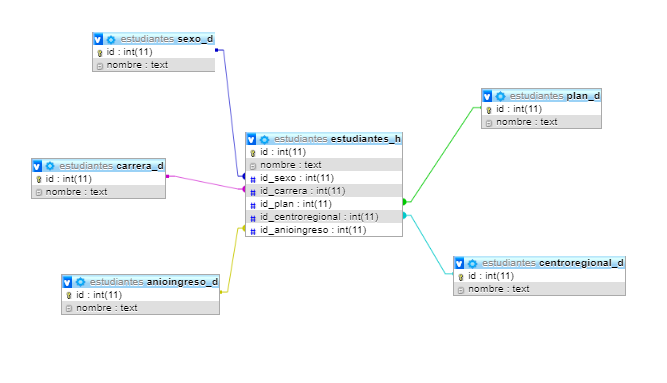
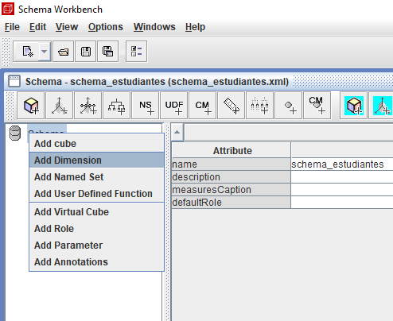
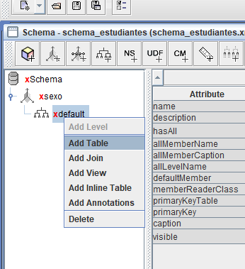
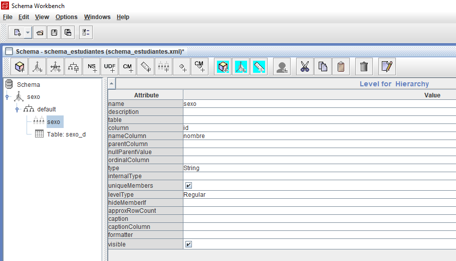
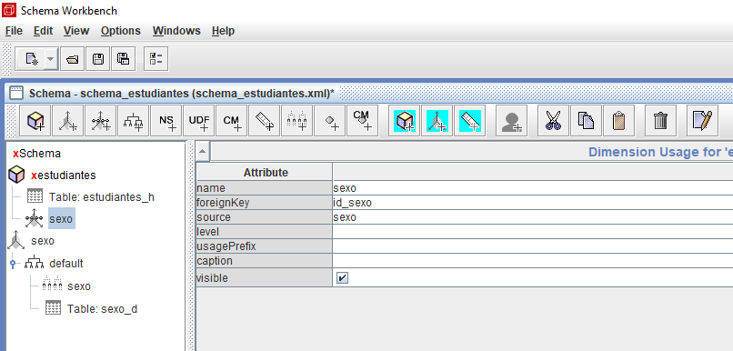
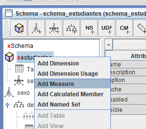
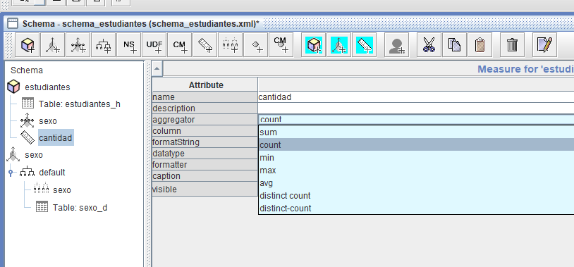
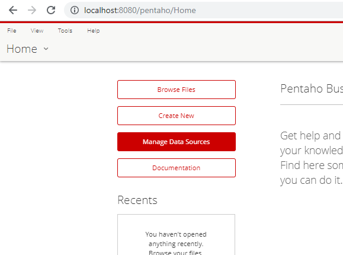
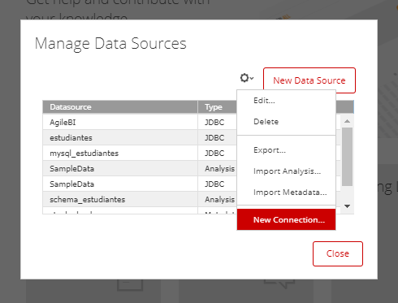
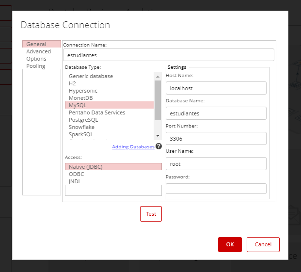

# Guía de LABORATORIO: Definición de cubos multidimensionales con Pentaho Schema Workbench (Mondrian)

## Introducción

### Conceptos iniciales

Mondrian Schema Workbench es una herramienta con una interfaz visual para crear cubos OLAP para luego procesar, a través del motor Mondrian, las solicitudes MDX contra esquemas ROLAP (Relacional OLAP, como vimos en clase). 
La herramienta genera estos esquemas a través de la denifición de modelos sobre los metadatos del esquema ROLAP en un archivo XML que consta de una estructura específica. Estos modelos XML pueden considerarse estructuras en forma de cubo que utilizan las tablas de hechos y dimensiones que se encuentran en el Sistema Gestor de Base de Datos Relacional utilizado (en el ejemplo que sigue será  MySQL). 
Como abordamos de forma teórica, los esquemas ROLAP no requieren que se construya o mantenga un cubo físico real; solo se crea el modelo de metadatos, que hace las veces de "cubo lógico".

### Requerimientos de Mondrian

Para empezar con el desarrollo del cubo es necesario:
- Tener Java instalado en la máquina (jdk de 64 bits, que ya viene con JRE).
- Configurar las variables de entorno JAVA_HOME (JDK) y JRE_HOME (JRE) ([Anexo I: Guía de Instalación Pentaho](https://github.com/bdm-unlu/2020/blob/master/guias/Java_configuracion.md)).
- Descargar Mondrian Schema Workbench.
- Instalar un SGBD relacional y descargar su correspondiente driver (en este ejemplo vamos a utilizar MySQL).
- Descargar en la carpeta _/drivers_ de Mondrian el jar con el driver para la conexión con la base de datos relacional. Aquí está el listado de [JDBC Drivers para Pentaho](https://help.hitachivantara.com/Documentation/Pentaho/8.0/Setup/JDBC_Drivers_Reference).

### Ejecución de Schema Workbench

Para correr la aplicación, hay que ejecutar la siguiente línea:
- workbench.sh (Ambientes Unix),
- workbench.bat (Ambientes Windows).

----

## Creación y Navegación de Cubos OLAP a través de Mondrian y Saiku (Suite Pentaho) 

El objetivo de esta guía es abordar los siguientes temas paso a paso:
1. Definición de un cubo a partir de Schema Workbench (Modelo ROLAP),
2. Publicación del cubo en el Servidor Pentaho.
3. Navegación del cubo con un Explorador OLAP (Saiku).

Para el abordaje de los temas anteriores, vamos a trabajar a partir de un _esquema de estrella_ para un cubo que permitir realizar análisis respecto de algunas características de los Estudiantes de la UNLu. Como vamos a trabajar sobre un Modelo ROLAP, asumiremos que partimos de una Base de Datos Relacional de MySQL con la siguiente estructura:

### Paso 1: Creación del cubo mediante Mondrian

1. Lo primero que debemos hacer es configurar es la conexión a la base de datos donde se encuentra nuestro modelo físico de la Base de Datos. En este caso, trabajaremos con MySQL, en el caso de utilizar otra base de datos debemos descargar el correspondiente driver Java y colocarlo en la carpeta __schema-workbench/drivers__. Accedemos a la configuración de la conexión de la Base de Datos a partir de la opción _Options > Connection..._ e ingresamos los datos correspondientes al acceso a la Base de Datos:

2. Una vez realizada la conexión, debemos crear el Esquema, para ello ingresamos desde la opción _File -> New -> Schema_. Aquí es importante hacer notar que un Schema es el ambiente del Data Warehouse y, como vimos en la clse teórica, un DW puede estar compuesto de múltiples cubos.

3. Luego, definimos el nombre que va a identificar a nuestro esquema (DW):

__Muy importante:__ En este ejemplo, incorporaremos las dimensiones fuera del Cubo que vamos a definir dado que esto será beneficioso en esquemas más complejos en los que necesitamos más de un cubo y es probable que necesitemos compartir las dimensiones. En este último caso, deberíamos definirlas cada vez que creemos uno nuevo. 
Si quisieramos definir las dimensiones dentro del cubo, previamente a la definición de las mismas crearemos el cubo a partir de la opción "Add cube" que aparece cuando presionamos click derecho sobre el Schema.

4. Realizada la salvedad anterior, vamos a trabajar directamente sobre el Schema (para luego poder compartir las dimensiones). Iniciamos la definición a partir de las dimensiones:

5. Dado que podemos definir dimensiones jerárquicas -como vimos en la clase teórica-, por defecto Mondrian crea una jerarquía. En este caso vamos a dejarla con el nombre por defecto:

6. Ahora debemos definir cual es la tabla de la Base de Datos Relacional que corresponde a la dimensión:

7. Vale aclarar que, si la conexión a la DB es correcta, la herramienta desplegará las tablas de la Base de Datos:

8. A continuación vamos a definir al menos un nivel (Level). Un nivel es cada uno de los atributos que representarán a una dimensión:

9. Aquí vamos a relacionar la tabla de la dimensión, en el campo _column_ va el identificador y el _nameColumn_ el campo descripción de la tabla:

La operatoria anterior la haremos para todas las dimensiones del Schema.

10. Una vez que terminamos, vamos a agregar el cubo con la tabla de hechos y sus relaciones. Para ello, creamos un cubo y definimos su nombre, el cual en general coincidirá con el de la tabla de hechos:

11. Relacionamos el cubo con la tabla de hechos, creando una tabla y seleccionando la tabla de hechos (en este caso _estudiantes_h_):

12. Ahora vamos a relacionar las dimensiones que creamos anteriormente. Seleccionamos la opcion _dimension usage_ en vez de crear una normal, esto nos permite seleccionar las dimensiones que tenemos disponibles en el esquema y compartirlas con múltiples cubos.

Si hubieramos trabajado a partir de la definición de dimensiones por cada cubo, deberíamos realizar las operaciones de los puntos 4 a 9 tal cual lo mostramos aunque lo haríamos directamente sobre el cubo y no sobre el Schema.

14. Una vez seleccionada la opción _dimension usage_, definimos el nombre, seleccionamos la _foreign key_ de la tabla de hechos que apunta a esa tabla de la dimensión y en el campo _source_ seleccionamos la dimensión que creamos anteriormente sobre el schema.

Esta operatoria la repetiremos para cada una de las dimensiones creadas.

15. Por último, solo restan definir las métricas del cubo. En nuestro caso, la métrica es _cantidad_ y representa a la cantidad de estudiantes. Para ello agregamos una medida:

16. Debemos definir el nombre en el atributo _name_ y en el campo _agregator_, seleccionamos la función de agregación que se aplicará sobre este campo:

17. A su vez, en el campo _column_, seleccionamos el campo con el que se va a realizar el cálculo, en este caso como sólo vamos a contar cantidad de registros (lo que llamamos un medida implícita en teoría), podriamos seleccionar cualquiera:

Cuando llegamos a este punto, la definición de nuestro cubo ha sido completada. 

### Paso 2: Publicación del cubo en el Servidor Pentaho

Ahora que ya hemos definido el cubo con sus dimensiones y métricas, necesitamos publicarlo en el _Pentaho Server_ para luego utilizarlo para su explotación mediante herramientas de análisis.

1. Para publicar el cubo, debemos ingresar en la siguiente opción:

2. Una vez que ingresamos a la opción, debemos completar las credenciales de acceso al Servidor Pentaho, las cuales consisten en la URL del servidor, el usuario y la clave. A su vez, también definimos el Data Source en el cual se publicará este nuevo cubo; pudiendo entender a un Data Source como un agrupamiento de cubos de una misma temática.

### Paso 3: Navegación del cubo con un Explorador OLAP (Saiku).

Una vez que tengamos el cubo publicado, vamos a acceder a Saiku, a través del _Pentaho Server_ para explorarlo. Para ello, debemos ejecutar el archivo _start_pentaho.sh (Unix) o start_pentaho.bat (Windows)_ e ingresar mediante un Navegador Web a la URL del mismo. Si en el periodo de instalación no modificamos el puerto por defecto, el enlace es [localhost:8080/pentaho/].

Nos logueamos en el Servidor e ingresamos a la opción _Manage Data Sources_.

Agregamos una nueva conexión:

Y colocamos los mismos datos que usamos para la conexión con Mondrian, es importante que el _Connection name_ sea el mismo.

Ingresamos a la opción _File > New > Saiku Analytics_ > Create a new query. 

Allí aparecerá el cubo que acabamos de publicar para poder realizar un análisis:

Con la herramienta Saiku, podemos cruzar múltiples dimensiones y ver como se calcula la medida:

Incluso podemos hacer gráficos sobre esos mismos cruces:

A su vez, hay infinidad de opciones y alternativas para explotar la información organizacional a partir de éste Explorador OLAP pero retomaremos esta etapa hacia el final de la cursada cuando trabajemos con _Data Analytics_.

## Referencias a recursos complementarios
- [Driver MySQL](https://dev.mysql.com/downloads/connector/j/),
- [Driver PostgreSQL](https://jdbc.postgresql.org/download.html),
- [Java JDK](https://www.oracle.com/java/technologies/javase-downloads.html),
- [Documentación Oficial Mondrian #1](https://mondrian.pentaho.com/documentation/installation_es.php),
- [Documentación Oficial Mondrian #2](https://mondrian.pentaho.com/documentation/workbench.php),
- [Documentación Oficial Mondrian #3](https://help.pentaho.com/Documentation/8.1/Products/Schema_Workbench),
- [Pentaho Suite #1](https://www.hitachivantara.com/go/pentaho.html),
- [Pentaho Suite #2](https://help.pentaho.com/Documentation/8.1),
- [Documentación Saiku](https://saiku-documentation.readthedocs.io/en/latest/).

